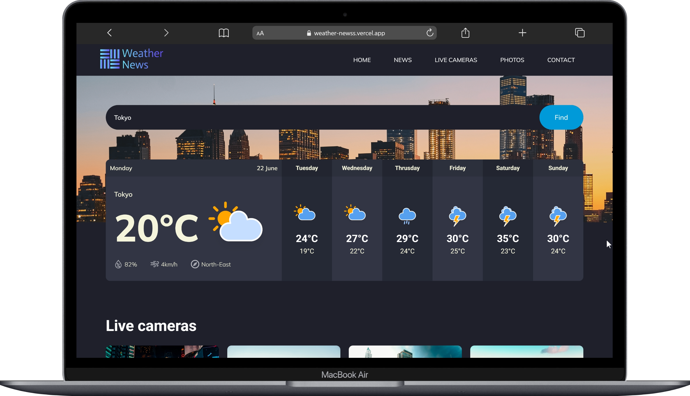
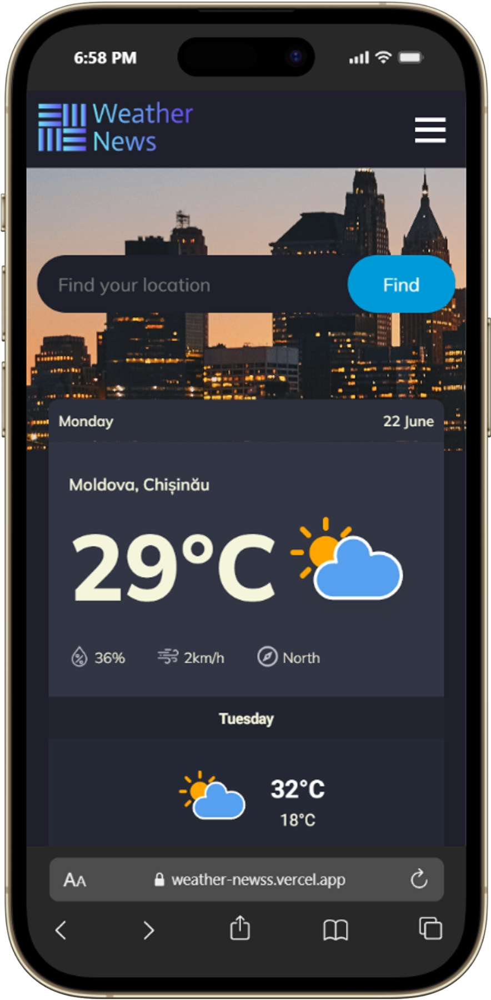

<div align="center">


# WeatherNews

**Real-time global weather forecasts, live cameras, and climate insights — all in one place.**

[](https://reactjs.org/)
[](LICENSE)
[](https://open-meteo.com/)
[](https://openweathermap.org/)
[](https://weather-newss.vercel.app/)

</div>

---

## Overview

WeatherNews is a modern, responsive weather application built with React. Search any city on Earth and instantly receive real-time temperature, humidity, wind speed, and a 7-day forecast. The app also features live city cameras from around the world, curated nature photography, and global climate insights.

---

## Screenshots

> _Add screenshots of your app here by placing images in `/src/images/screenshots/` and linking them below._

| Home / Search                              | Forecast Panel                                 | Mobile View                                    |
| ------------------------------------------ | ---------------------------------------------- | ---------------------------------------------- |
|  |  |  |

---

## Features

- **Global City Search** — Enter any city name to retrieve live weather data via the OpenWeatherMap geocoding API
- **Real-Time Weather** — Current temperature, humidity, wind speed, and wind direction powered by Open-Meteo
- **7-Day Forecast** — Daily max/min temperatures with weather condition icons for the week ahead
- **Dynamic Weather Icons** — 11 condition-mapped SVG icons covering sun, clouds, fog, rain, snow, sleet, and thunderstorms
- **Live City Cameras** — Embedded links to real-time streams from New York, Paris, Chicago, and Budapest
- **Responsive Design** — Fully mobile-optimized layout with a hamburger nav for small screens
- **Animated Loader** — Smooth entrance experience: the loader persists until all API data resolves

---

## Tech Stack

| Layer        | Technology                                                                   |
| ------------ | ---------------------------------------------------------------------------- |
| Framework    | React 18 (Create React App)                                                  |
| Language     | JavaScript (ES2020+)                                                         |
| Styling      | Plain CSS with CSS animations                                                |
| Weather Data | [Open-Meteo API](https://open-meteo.com/) (free, no key required)            |
| Geocoding    | [OpenWeatherMap Geocoding API](https://openweathermap.org/api/geocoding-api) |
| HTTP Client  | Fetch API (native browser)                                                   |

---

## Getting Started

### Prerequisites

- Node.js `>=14.0.0`
- npm `>=6.0.0`

### Installation

```bash
# Clone the repository
git clone https://github.com/your-username/weathernews.git
cd weathernews

# Install dependencies
npm install

# Start the development server
npm start
```

The app will open at [http://localhost:3000](http://localhost:3000).

### Build for Production

```bash
npm run build
```

The optimised bundle is output to the `/build` folder, ready for any static hosting provider.

---

## Environment & API Keys

WeatherNews uses two external APIs:

| API                                           | Purpose                      | Key Required    |
| --------------------------------------------- | ---------------------------- | --------------- |
| [Open-Meteo](https://open-meteo.com/)         | Weather + forecast data      | No              |
| [OpenWeatherMap](https://openweathermap.org/) | City → coordinates geocoding | Yes (free tier) |

To configure your OpenWeatherMap key, locate the constant in `src/components/Forecast.js`:

```js
const API_KEY = "your_api_key_here";
```

> **Note:** For production deployments, move this value to an `.env` file and reference it as `process.env.REACT_APP_OWM_API_KEY` to avoid exposing the key in your source code.

```env
# .env
REACT_APP_OWM_API_KEY=your_api_key_here
```

---

## Project Structure

```
weathernews/
├── public/
│   └── index.html
├── src/
│   ├── components/
│   │   ├── Forecast.js       # Core weather logic, API calls, DOM updates
│   │   ├── Header.js         # Navigation bar with mobile hamburger menu
│   │   ├── Loader.js         # Animated loading screen
│   │   └── Logo.js           # Logo component
│   ├── images/
│   │   ├── icons/simple/     # SVG weather condition icons
│   │   └── ...               # City camera thumbnails, background images
│   ├── App.js                # Root component; manages loading state
│   ├── index.js              # React DOM entry point
│   ├── style.css             # Global styles and responsive breakpoints
│   └── loader.css            # Loader animation keyframes
├── package.json
└── README.md
```

---

## How It Works

### Loading Flow

```
App mounts
  └─> Loader renders (full-screen)
  └─> <Forecast> mounts (hidden via CSS)
        └─> useEffect fires → fetches Open-Meteo API
              └─> Data resolves → calls onDataLoaded()
                    └─> App sets loading = false
                          └─> Loader unmounts, content fades in
```

This pattern keeps `<Forecast>` mounted during the load so its `useEffect` runs and API calls complete before the UI is shown, avoiding a flash of empty content.

### City Search Flow

```
User types city name → clicks "Find" (or presses Enter)
  └─> OpenWeatherMap Geocoding API → returns lat/lon
        └─> Open-Meteo API called with new coordinates
              └─> Current weather + 7-day forecast rendered
```

If the city is not found, a "not found" image replaces the forecast panel and the daily cards are hidden.

### Weather Code Mapping

The app maps WMO weather interpretation codes from Open-Meteo to one of 11 SVG icons:

| Code(s)        | Condition      | Icon             |
| -------------- | -------------- | ---------------- |
| 0              | Clear sky      | Sunny Day        |
| 1              | Mainly clear   | Partly Cloudy    |
| 2–3            | Overcast       | Cloudy           |
| 45, 48         | Fog            | Fog              |
| 51–65, 80–81   | Drizzle / Rain | Rainy            |
| 56–57, 66–67   | Freezing rain  | Rain & Snow Mix  |
| 71             | Light snow     | Snowy (light)    |
| 73             | Moderate snow  | Snowy (moderate) |
| 75, 77, 85, 86 | Heavy snow     | Snowy (heavy)    |
| 82             | Rain showers   | Rain & Sleet Mix |
| 95, 96, 99     | Thunderstorm   | Thunder          |

---

## Available Scripts

| Command         | Description                                          |
| --------------- | ---------------------------------------------------- |
| `npm start`     | Runs the app in development mode at `localhost:3000` |
| `npm test`      | Launches the test runner in interactive watch mode   |
| `npm run build` | Builds the app for production to the `/build` folder |
| `npm run eject` | Ejects CRA config (irreversible)                     |

---

## Deployment

WeatherNews can be deployed to any static hosting service. Here are quick guides for the most common options:

**Vercel**

```bash
npm install -g vercel
vercel --prod
```

**Netlify**

```bash
npm run build
# Drag and drop the /build folder into Netlify's dashboard
```

**GitHub Pages**

```bash
npm install --save-dev gh-pages
# Add "homepage": "https://your-username.github.io/weathernews" to package.json
npm run build && npx gh-pages -d build
```

---

## Roadmap

- [ ] Hourly forecast chart (precipitation / temperature over 24h)
- [ ] Unit toggle: Celsius ↔ Fahrenheit
- [ ] Dark / light theme switcher
- [ ] Geolocation-based auto-detect on first load
- [ ] Offline support via service worker / PWA manifest
- [ ] Animated weather backgrounds that change with conditions
- [ ] Move API key management to a lightweight backend / serverless function

---

## Contributing

Contributions are welcome! To get started:

1. Fork the repository
2. Create a feature branch: `git checkout -b feature/my-feature`
3. Commit your changes: `git commit -m "feat: add my feature"`
4. Push to your branch: `git push origin feature/my-feature`
5. Open a Pull Request

Please follow the existing code style and keep PRs focused on a single change.

---

## License

This project is licensed under the [MIT License](LICENSE).

---

## Acknowledgements

- Weather data provided by [Open-Meteo](https://open-meteo.com/) — free, open-source, no API key required
- Geocoding by [OpenWeatherMap](https://openweathermap.org/)
- Weather icons from [amCharts Free SVG Maps & Icons](https://www.amcharts.com/free-animated-svg-weather-icons/)
- Live camera streams sourced from YouTube and EarthCam

---

<div align="center">

Developed with ❤️ by **Alexandru Gurgurov**

</div>
